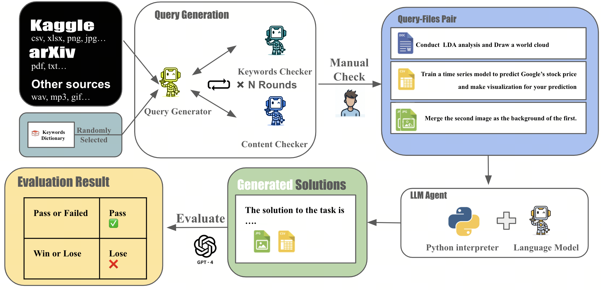

<h1 align="center"> PyBench: Evaluate LLM Agent on Real World Tasks </h1>

<p align="center">
<a href="comming soon">📃 Paper</a>
•
<a href="comming soon" >🤗 Data (PyInstruct)</a>
•
<a href="https://huggingface.co/Mercury7353/PyLlama3" >🤗 Model (PyLlama3)</a>
•
</p>  


PyBench is a comperhensive benchmark evaluting LLM on real world coding tasks including **chart data analysis**, **text data analysis**, **image/ audio editing** and **software / website development**.  
 We collect files from Kaggle, arXiv and another sources and automatically generate querys according to the type and content of each file.  

   


## Why we need PyBench?

The LLM Agent, equipped with a code interpreter, is capable of automatically solving real-world coding tasks, such as data analysis and image processing.
%
However, existing benchmarks primarily focus on either simplistic tasks, such as completing a few lines of code, or on extremely complex and specific tasks at the repository level, neither of which are representative of various daily coding tasks. 
%
To address this gap, we introduce **PyBench**, a benchmark that encompasses 6 main categories of real-world tasks, covering more than 10 types of files. 
   

## 📁 PyInstruct

To figure outout a way enhacing model's ability on PyBench, we generate a homologous dataset: **PyInstruct**. The PyInstruct contains multi-turn interaction between model and files, stimulating models capility on coding, deugging and multi-turn complex task solving.  Compare to other Datasets focus on multi-turn coding ability, PyInstruct has longer turns and tokens per trajectory.  


*Dataset Statistics. Token statistics are computed using Llama-2 tokenizer.*

## 🪄 PyLlama

Trained on **PyInstruct** and general conversations, **CodeActAgent** excels at out-of-domain agent tasks compared to open-source models of the same size, while not sacrificing generic performance (e.g., knowledge, dialog). We release two variants of CodeActAgent:
- **CodeActAgent-Mistral-7b-v0.1** (recommended, [model link](https://huggingface.co/xingyaoww/CodeActAgent-Mistral-7b-v0.1)): using Mistral-7b-v0.1 as the base model with 32k context window.
- **CodeActAgent-Llama-7b** ([model link](https://huggingface.co/xingyaoww/CodeActAgent-Llama-2-7b)): using Llama-2-7b as the base model with 4k context window.


*Evaluation results for CodeActAgent. ID and OD correspondingly stand for in-domain and out-of-domain evaluation. Overall averaged performance normalizes the MT-Bench score to be consistent with other tasks and excludes in-domain tasks for fair comparison.*


Please check out [:page_with_curl: our paper](TODO) for more details about data collection, model training, evaluation, and more!


## 🚀 Evaluate your model on PyBench!

<video src="COMMING SOON"> </video>
*Demo of the chat interface.*

### Build the Environment  


### Run your model on vllm server   


### Run Inference to get outut files and trajectory  


### Evaluate the output on Unit Test   


### 📊 LeaderBoard 

Please refer to [docs/EVALUATION.md](docs/EVALUATION.md) for detailed instruction.

## 📚 Citation

```bibtex
@inproceedings{wang2024executable,
      title={Executable Code Actions Elicit Better LLM Agents}, 
      author={Xingyao Wang and Yangyi Chen and Lifan Yuan and Yizhe Zhang and Yunzhu Li and Hao Peng and Heng Ji},
      year={2024},
      eprint={2402.01030},
      booktitle={ICML}
}
```
