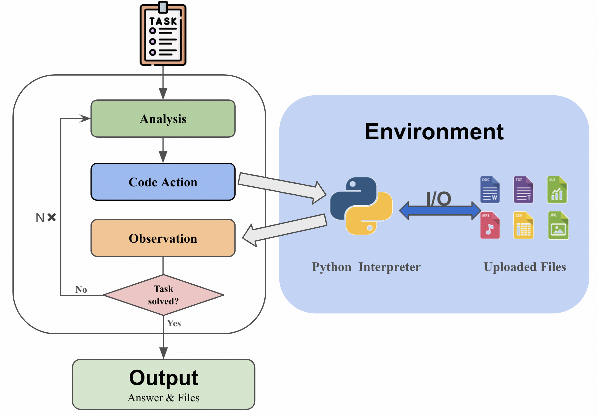

<h1 align="center"> PyBench: Evaluate LLM Agent on Real World Tasks </h1>

<p align="center">
<a href="https://arxiv.org/abs/2407.16732">📃 Paper</a>
•
<a href="https://huggingface.co/datasets/Mercury7353/PyInstruct" >🤗 Data (PyInstruct)</a>
•
<a href="https://huggingface.co/Mercury7353/PyLlama3" >🤗 Model (PyLlama3)</a>
•
<a href="https://mercury7353.github.io/pybench.github.io/" >🕸️ Website</a>
</p>  


PyBench is a comprehensive benchmark evaluating LLM on real-world coding tasks including **chart analysis**, **text analysis**, **image/ audio editing**, **complex math** and **software/website development**.  
 We collect files from Kaggle, arXiv, and other sources and automatically generate queries according to the type and content of each file.  

   


## Why PyBench?

The LLM Agent, equipped with a code interpreter, is capable of automatically solving real-world coding tasks, such as data analysis and image processing.
%
However, existing benchmarks primarily focus on either simplistic tasks, such as completing a few lines of code, or on extremely complex and specific tasks at the repository level, neither of which are representative of various daily coding tasks. 
%
To address this gap, we introduce **PyBench**, a benchmark that encompasses 6 main categories of real-world tasks, covering more than 10 types of files. 
   

## 📁 PyInstruct

To figure out a way to enhance the model's ability on PyBench, we generate a homologous dataset: **PyInstruct**. The PyInstruct contains multi-turn interaction between the model and files, stimulating the model's capability on coding, debugging and multi-turn complex task solving.  Compare to other Datasets focus on multi-turn coding ability, PyInstruct has longer turns and tokens per trajectory.  


*Dataset Statistics. Token statistics are computed using Llama-2 tokenizer.*

## 🪄 PyLlama

We trained Llama3-8B-base on PyInstruct, CodeActInstruct, CodeFeedback, and Jupyter Notebook Corpus to get PyLlama3, achieving an outstanding performance on PyBench


## 🚀 Model Evaluation with PyBench! 
<video src="https://github.com/Mercury7353/PyBench/assets/103104011/fef85310-55a3-4ee8-a441-612e7dbbaaab"> </video> 
*Demonstration of the chat interface.* 
### Environment Setup: 
Begin by establishing the required environment:   

```bash 
conda env create -f environment.yml
```   

### Model Configuration 
Initialize a local server using the vllm framework, which defaults to port "8001":     

```bash 
bash SetUpModel.sh
```   


A Jinja template is necessary to launch a vllm server. Commonly used templates can be located in the `./jinja/` directory.  
Prior to starting the vllm server, specify the model path and Jinja template path in `SetUpModel.sh`.     
### Configuration Adjustments   
Specify your model's path and the server port in `./config/model.yaml`. This configuration file also allows for customization of the system prompts.  
### Execution on PyBench  
Ensure to update the output trajectory file path in the script before execution:    

```bash 
python /data/zyl7353/codeinterpreterbenchmark/inference.py --config_path ./config/<your config>.yaml --task_path ./data/meta/task.json --output_path <your trajectory.jsonl path>
```  


### Unit Testing Procedure   
- **Step 1:** Store the output files in `./output`.
- **Step 2:** Define the trajectory file path in
  `./data/unit_test/enter_point.py`.
- **Step 3:** Execute the unit test script: 
  ```bash
  python data/unit_test/enter_point.py  
  ```
  
## 📊 LeaderBoard 
   
# 📚 Citation 
```bibtex
@misc{zhang2024pybenchevaluatingllmagent,
      title={PyBench: Evaluating LLM Agent on various real-world coding tasks}, 
      author={Yaolun Zhang and Yinxu Pan and Yudong Wang and Jie Cai and Zhi Zheng and Guoyang Zeng and Zhiyuan Liu},
      year={2024},
      eprint={2407.16732},
      archivePrefix={arXiv},
      primaryClass={cs.SE},
      url={https://arxiv.org/abs/2407.16732}, 
}
``` 
